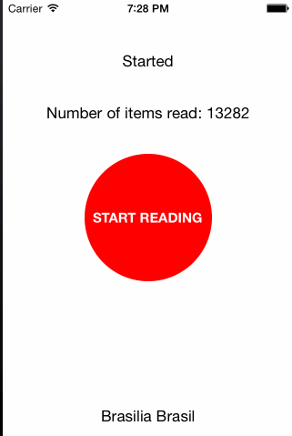

ACBatchReader
================

ACBatchReader let's you read a `plist` in a background process with periodic returns of batch data in the main thread.


Installation and usage
----------------------
1. Copy `ACBatchReader.h` and `ACBatchReader.m` to your Xcode project.
2. Create a new instance of `ACBatchReader` 
3. Implement `ACBatchReaderDelegate`.
4. Set the batch size. (`batchSize` property)
5. Set the fileName (`setFileName:`)
6. Call `startReadingWithParser:` to start the background read. This method has a block as a parameter. This block receives a dictionary with the element just read from the file. This block needs to return an object or nil, if you don't want to add the current object to the results. 


Examples
--------
 __Set up:__
```objective-c
self.batchReader = [[ACBatchReader alloc] init];
self.batchReader.debug = YES;
self.batchReader.delegate = self;
self.batchReader.batchSize = 1;
[self.batchReader setFileName:@"dummy-data"];
```

 __Start Parsing:__ If you want to filter some objects you can just return a nil object when you don't want that kind of result in your resulting array.
```objective-c
[self.batchReader startReadingWithParser:^id(NSDictionary *element) {
        ACDummyContainer *dummy = [[ACDummyContainer alloc] init];
        dummy.city = element[@"city"];
        dummy.country = element[@"country"];
        
        return dummy;
}];
```
```objective-c
- (void) batchRead:(NSArray *)batch{
    //the size of this batch is the one set in the configuration.
    [self.elementsRead addObjectsFromArray:batch];
}

- (void) batchFinished{
    NSLog(@"Finished Background Task");
}

```

The result will be: 




Version
----
1.0

License
----
MIT


**Free Software, Hell Yeah!**
